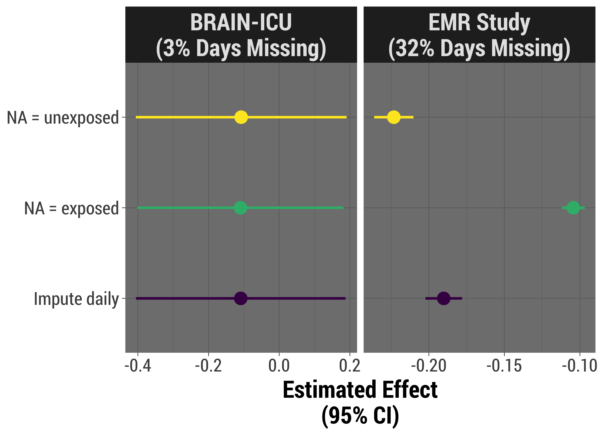

## TODO

Make the title slide better.

- Add Twitter, Github?
- Footer with link to repo

```{r setup, include=FALSE}
options(htmltools.dir.version = FALSE)
knitr::opts_chunk$set(echo = FALSE)

```

---

# Our Motivation

```{r}
knitr::include_graphics("presfigures/manualfigs/exposure_only.png")
```

???

- Work with a research group which focuses on critically ill
- Many projects involve both an in-hospital and one or more long-term components:
    - Cognitive impairment
    - Functional impairment and quality of life
    - Mortality
- So often our exposure of interest is measured daily while the patient is hospitalized
- Here, we have a patient who was hospitalized for five days, had the exposure of interest on three days and no exposure on the other two

---

# Our Motivation

```{r}
knitr::include_graphics("presfigures/manualfigs/exposure_outcome.png")
```

--

Is more delirium *(in-hospital brain dysfunction)* associated with scores on a cognitive test after hospital discharge?

```{r}
knitr::include_graphics("presfigures/manualfigs/brains.png")
```

???

Then we might want to somehow summarize that exposure and see if it's related to some long-term outcome.

**SLIDE**

BRAIN-ICU cohort:
- published in 2013
- interested in whether the duration or amount of delirium a patient experienced in the hospital was associated with performance on a test of cognitive ability up to a year after they were discharged

Other possible examples:

- More severe sepsis -> higher rate of long-term death among survivors?
- Average (min, max) severity of illness related to functional outcomes?

---
class: inverse, center, middle

# The Problem

.pull-left[
### Prospective cohort

```{r}

```
*BRAIN-ICU Cohort Study, NEJM 2013*
]

--

.pull-right[
### Retrospective EMR
```{r}
knitr::include_graphics("presfigures/retro_vismiss.png",)
```
]

???

Describe visdat:
- From BRAIN-ICU study
- Purple = not missing, yellow = a day with no delirium assessment
- Low proportion of patient-days missing
- This is often the case for our **prospective** studies, thanks to our excellent staff of research coordinators
- Reason to believe missingness or more or less completely at random - patient in a procedure, for example
- So in BRAIN we did single imputation to "fill these in" and summarize our exposure, but not a big deal; little worry about bias

**And then...**

- Interested in a retrospective study using EMR data in a trauma unit, same exposure (different outcomes)
- Delirium assessments are done, but not as often as in medical or surgical units
- *change slides*
- In fact, nearly 1/3 of our in-hospital days are missing the delirium assessment
- This missingness is almost certainly NOT at random
    - Severely ill patients might be ventilated, comatose; perhaps staff didn't think assessment was necessary, but we can't necessarily tell that they were comatose from the data
    - Alternately: less sick patients who are up, walking, having conversation may also not have gotten assessed, because the staff thinks it's clear that they're fine
- In other words, using data collected for clinical purposes for research has challenges!

So, how to deal with the missingness in the way that gives us least bias?

Four strategies:

---

# Strategies: Simple

.pull-left[
  ### Assume the "best"
  *Only count the exposure we know about*
  
```{r}

```
]

--

.pull-right[
  ### Assume the "worst"
  *All missing time points get exposure*

```{r}

```
]

--

**Pros**: Straightforward to implement; plausible, *if* we know a lot about data collection
  
**Cons**: Prone to bias

---

background-image: url(presfigures/imputesummary.png)
background-size: 328px
background-position: 90% 35%

# Strategies: Imputation

.left[
  ### Assume nothing
  
  1. If subject missing any time point,<br>
  entire summary value = `NA`
  1. Multiply impute missing *summary values*<br>
  before modeling
]
--
<br>
<br>
.pull-left[
**Pros**:
  - Fairly simple to implement
  - Acknowledges uncertainty
]

.pull-right[
**Cons**:
  - Ignores the data we *do* have
  - Likely to *overestimate* uncertainty
]

---
background-image: url(presfigures/imputedaily.png)
background-size: 365px
background-position: 90% 35%

# Strategies: Imputation

.left[
  ### Assume the minimum
  
  1. Multiply impute missing *time points*
  1. Summarize each imputed dataset
  1. Use these imputed summary<br>datasets when modeling
]

--

.pull-left[
**Pros**:
  - Maximizes use of data we have
  - Fewest assumptions about missing values
]

.pull-right[
**Cons**:
  - Computation time
  - Data wrangling
]

---

# Simulations

- 5%, 20%, 35%, 50% of patient-days missing exposure value
- Types of missingness:
    - MCAR
    - MAR
        - Missingness in exposure weakly, moderately, strongly associated with daily severity of illness
    - MNAR
        - Missingness in exposure weakly, moderately, strongly associated with true exposure value
- True relationship with outcome: ranges from 0 to -5
- Imputation methods incorporate severity of illness

---

class: inverse, center, middle

# BIAS

---
class: inverse

background-image: url(presfigures/bias.png)
background-size: cover

???

1. Vertical panels = percent missing
1. Horizontal panels = type of missingness
1. X axis = true association between exposure and outcome
1. Y axis = bias
1. For MAR, weak/moderate/strong indicates the strength of association between missingness and a covariate - in our case, severity of illness
1. For MNAR, weak/moderate/strong indicates the strength of association between missingness and the true value of our daily exposure

---

class: inverse, center, middle

# STANDARD ERRORS/<br>CI WIDTH

---

background-image: url(presfigures/se_beta.png)
background-size: cover

---

background-image: url(presfigures/ci_width.png)
background-size: cover

---

class: inverse, center, middle

# COVERAGE

---

background-image: url(presfigures/coverage.png)
background-size: cover

---

class: inverse, center, middle

# POWER

---

background-image: url(presfigures/power.png)
background-size: cover

---

# Real Life

.left-column[
- Duration of exposure vs outcome in two real-world studies
- Three strategies to summarize duration of exposure
]

--

.right-column[

```{r}

```
]

---

background-image: url(presfigures/missingdata.jpg)
background-position: 5% 40%

class: middle, inverse

.pull-right[
  ### Future Exploration

  - Continuous exposure
  - Different relationships between<br>covariates/exposure and missingness
]

.pull-right[
  ### Acknowledgements

  - VUMC CIBS Center Principal Investigators
  - Stef van Buuren for mice
  - Davis Vaughn, Henrik Bengetsson for furrr and futures
  - Brooke Watson for BRRR
  
]

<div class="photo-footer"><i>Photo used by permission of <a href = http://bit.ly/etsy-missing>NausicaaDistribution Etsy shop</a>, bit.ly/etsy-missing</i></div>
